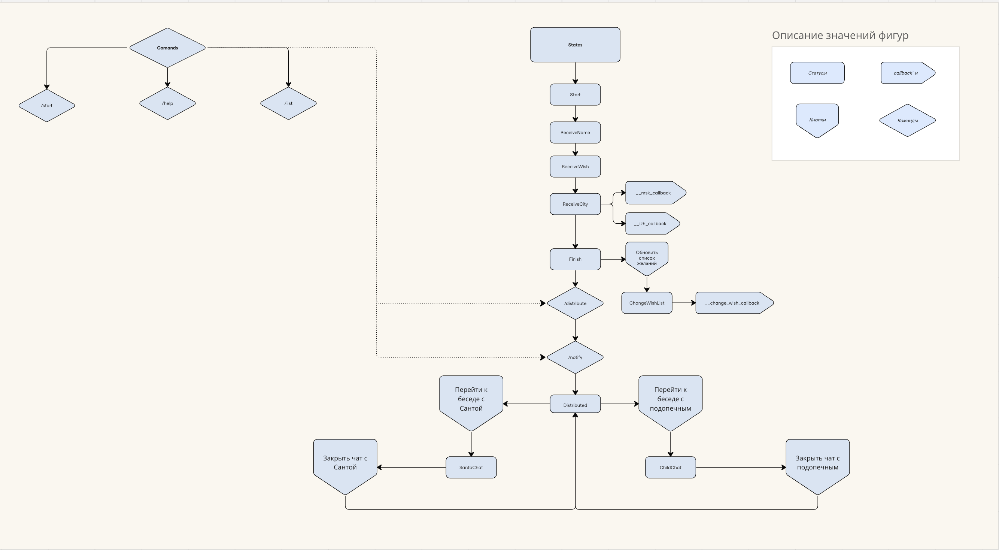

# SantaBot (Тайный санта) - Телеграм бот для анонимного распределения подарков

SantaBot - это телеграм бот, написанный на языке программирования Rust, который предназначен для анонимного
распределения получателей и дарителей новогодних подарков.

## Возможности бота:

1. Ввод имени: Пользователь может ввести свое имя для участия в розыгрыше Тайного санты.
2. Создание списка желаемых подарков: Пользователь может добавить в боте список желаемых подарков, которые могут быть
   видны только его "Санте".
3. Указание города проживания: Необходимо для группировки пользователей, чтобы одна группа строго дарила подарки
   другой (требуется четное кол-во участников).
4. Обновление списка желаемых подарков: Возможность обновления списка желаемых подарков, до начала распределение.
5. Чат с подопечным: Возможность общения с человеком, которому вы дарите подарок, анонимно через бота.
6. Чат с Сантой: Возможность общения с "Сантой", который дарит подарок вам, анонимно через бота.

## Стек технологий:

- Язык программирования: Rust
- Библиотеки: tokio, teloxide
- ORM: sea-orm
- СУБД: PostgreSQL

## Инструкции по установке и запуску:

1. Клонируйте репозиторий с ботом на свой компьютер.
2. Зарегистрируйте своего бота на @BotFather
3. Установите необходимые зависимости, согласно файлу Cargo.toml.
4. Создайте файл .cargo/config.toml на основе .cargo/config.toml.example
5. Пропишите настройки к базе данных и токен в .cargo/config.toml или в env. В локальной конфигруции работает на Long
   Polling, а в продакшен окружении использует Webhooks

## Схема:

